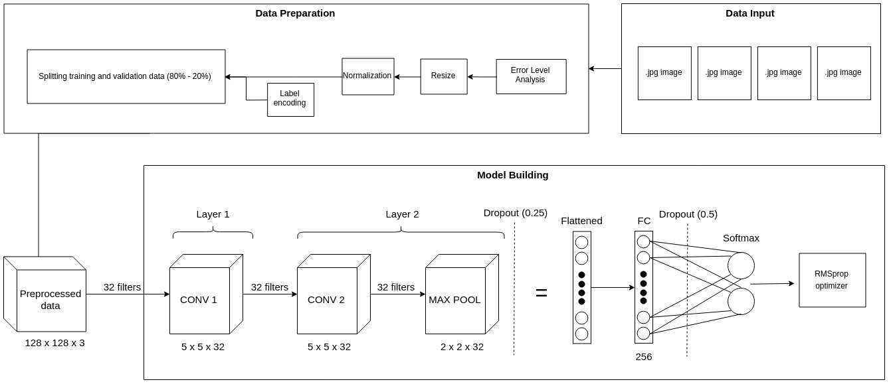

# Fake Image Detector

**Image Tampering Detection using ELA and CNN**

## Project objective
Combine the implementation of error-level analysis (ELA) and deep learning to detect whether an image has undergone fabrication or/and editing process or not, e.g. splicing.

## Methods
1. Error-level analysis
2. Convolutional neural networks (CNN)

## Architecture

## Result
- Convergence: Epoch 9
- Best accuracy: 91.83% (epoch 9)

## Dataset
(https://www.kaggle.com/datasets/sophatvathana/casia-dataset).

## 🎨 **Connect With Me**

  
  
  

---

  © 2025 <strong>Charan Reddy</strong>. All rights reserved.

